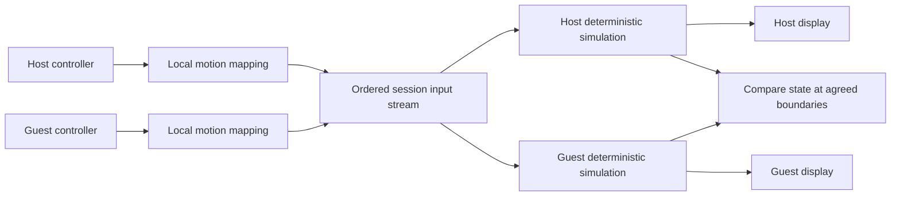

# Riisorted online play — proposed design

Status: approved direction; experimental two-player direct networking implemented.
See [online instructions](Riisorted-online-development.md) for hosting/joining,
session saves, and current limitations, and [recording notes](Riisorted-netplay-development.md)
for the earlier input diagnostics. Deterministic scheduling and complete game-state
verification remain outstanding; the design below includes future work.

## First release

Two PCs run the same Wii Sports Resort local multiplayer session. Each person
controls their assigned virtual Wii Remote. Both screens show the game's normal
local multiplayer view, including its shared camera, split screen, or turns.
This covers local versus and cooperative modes where the game supports them;
it does not add multiplayer to single-player activities.

The launcher hosts or joins the session. The host chooses the sport using the
existing game menus. Seamless in-game invitations, separate cameras, spectators,
four players, matchmaking, and new multiplayer modes are later work.

Initial proposed scope:

- Two peers, matching approved x86-64 runtime build, game content, and Riisorted
  overlays. Start on Linux; cross-platform compatibility needs its own gate.
- Direct IP connection for LAN and internet connections that allow it.
- Host save data, shared session Miis, equal input delay.
- One simultaneous multiplayer sport first, then a turn-based sport, then
  expand the supported list sport by sport. Confirmed first target: Swordplay Duel.
- Existing controller and keyboard/mouse mappings feed online input. Network
  transport must preserve those mappings, not introduce another motion mapper.

## Architecture: deterministic input lockstep

Both peers start from identical session data and consume the same ordered input
stream. The host coordinates the session and assigns inputs to simulation time.
It does not continuously broadcast native process memory or video.

Lockstep avoids speculative swings and rollback corrections in the first
version. It requires a deterministic runtime; identical inputs alone are not
enough. An authoritative video-streaming design would avoid replicated simulation
desync, but would be a different experience with guest video latency and host
encoding requirements. It is not the proposed first implementation.

### Current code that must change or be audited

| Area | Current evidence | Required contract |
| --- | --- | --- |
| Wii time base | `runtime/wsr/src/ppc_helpers.cpp`: `GetTimeBase()` reads `steady_clock` | Shared logical time, including direct PPC time-base reads |
| OS time | `runtime/wsr/src/hle/os/os_time.cpp`: system time adds a guest base to the time base; `main.cpp` seeds time from the host | Identical session epoch and deterministic time reads |
| Retraces | `fiber_manager.cpp`: drains a wall-clock-driven pending retrace counter | Retraces scheduled by simulation progress, never by PC speed or accumulated network waits |
| Presentation | `main.cpp`, `hle/vi.cpp`, `hle/gx/gx_copy.cpp`: presentation waits can pump runtime work | Display pacing must not determine guest event order |
| Motion input | `resort_wiimote_kbm.cpp`: virtual remote only on channel 0; approximately 200 Hz sample model and wall-clock sampling | Independent channel state and an agreed sample timeline |
| NAND callbacks | `hle/storage/nand_async.cpp`: queued callbacks pumped by runtime | Identical dispatch ordering and logical completion boundaries |
| GPU feedback | `hle/gx/gx_copy.cpp`: small EFB probes asynchronously land in guest RAM | Identical game-visible bytes and completion timing |
| Guest fibers | `include/fiber_manager.h`: opaque host contexts and saved CPU registers | Deterministic scheduling; no assumption that RAM alone is a complete snapshot |

Audit alarms, DVD completion, audio callbacks, RNG initialization, filesystem
enumeration, floating-point behavior, and all other host-time reads before
calling the runtime deterministic. Native recompilation does not establish this
property by itself.

### Simulation clock and scheduling

Use integer logical time with a rational retrace period appropriate to the game's
VI configuration. Presentation FPS is not the network tick. Define deterministic
execution/yield boundaries for progressing time inside a retrace interval;
freezing the time base for a whole frame can deadlock guest polling loops.
The exact execution-accounting mechanism is the first runtime design spike.

At an agreed boundary, simulation may proceed only when the input scheduled for
that interval is complete. Both peers dispatch the same ordered guest events.
While waiting, no guest retraces, alarms, motion integration, or save operations
advance. UI, connection management, and local device sampling continue.
Retain only bounded pending input; never turn a long pause into a burst of old
swings on resume. Pause/resume establishes an agreed fresh sampling boundary.

Rendering and audio presentation can have different wall-clock completion times.
Anything they expose to guest code needs a deterministic contract. For GPU
feedback, investigate whether the bytes can influence gameplay. Where they can,
use reproducible CPU results or host-supplied canonical readback bytes applied
at agreed logical boundaries. Do not assume different GPUs produce identical
pixels. Presentation-only state can differ only after proving it has no path
back into simulation.

### MotionPlus input protocol

Capture input independently of network arrival and rendering. Convert hardware
measurements into a versioned virtual Wii Remote representation once, on the
owning PC. Share the exact representation consumed by guest input processing:
buttons, accelerometer, pointer/IR validity and coordinates, MotionPlus rates,
orientation/angles where supplied, extension state, and calibration metadata.

The protocol must settle which derived fields belong to the local mapper and
which belong to deterministic guest processing. Never integrate the same sensor
stream independently using two PCs' wall clocks. Preserve multiple motion samples
within a simulation interval; one button packet per displayed frame is insufficient.
Use explicit byte order and field widths, with validated finite numeric values;
do not serialize padded C++ structs or host timestamps.

Guest reads consume an agreed sample history. Multiple readers, button edges,
sample counts, `keepLast`, calibration resets, MotionPlus mode changes, and raw
WPAD versus KPAD reports must all have consistent semantics. Read timing cannot
pull fresh local input behind the network's back.

Host input normally maps to Wii channel 0; guest input to channel 1. Turn-based
modes that share one Wii Remote need an agreed ownership handoff for channel 0.
Game mode inspection determines that handoff; it must not be inferred from a
peer's local controller movement. Rumble routes to the owner of the addressed
channel. Controller loss and fallback produce ordered device/input events.

## Lag, packet loss, and connection handling

- Negotiate an input buffer from measured round-trip time, jitter, and simulation
  performance. Display the resulting added delay in milliseconds. Equal delay
  applies to host and guest in simultaneous play.
- Use sequenced, authenticated input packets with acknowledgments, redundant
  recent samples, deduplication, and bounded retransmission. Keep reliable setup
  and bulk Mii/save transfer from blocking the time-sensitive input path.
- Missing input pauses both simulations at a shared boundary. Never silently
  predict a swing or replace missing motion with a held button state.
- Adjust delay only with an agreed schedule at a safe boundary. Avoid skipping
  or repeating input when the buffer changes.
- Slow PCs also cause stalls. Report whether waiting is caused by input arrival
  or simulation progress, rather than labeling everything as network lag.
- Disconnect pauses the session. A brief reconnection may continue only when
  both peers retain matching state at the same boundary. A restarted process
  needs a new boot or a future supported recovery mechanism.

Choose a maintained transport library during implementation; do not write an
ad hoc reliability or cryptography layer. P2P describes the game data path, not
a guarantee that all routers can connect. Room codes will need rendezvous and
NAT traversal services. Restrictive NAT may require a relay, which can be an
explicit later option. Initial direct connect should state when router setup is
necessary and authenticate the invited peer with a session secret.

## Saves and Miis

1. Lock the host installation against concurrent play or Mii editing.
2. Copy the host's title save and the required Wii settings into a session
   sandbox. Inventory all game-read NAND files; send only the agreed allowlist.
3. Merge guest Mii records into a session copy of the host's `RFL_DB.dat` using
   `launcher/mii_data.py`. Distribute this exact final database to both peers.
4. Verify installed game content and `RFL_Res.dat` locally. Do not transfer the
   installed game or Wii system content as part of the lobby.
5. Run both games against identical sandbox contents. Only the host may commit
   progress back to its installation, with backup and atomic replacement.
   Guest saves and the guest's personal Mii database remain untouched.

There are 100 visible Mii slots. Transfer every guest Mii when capacity permits;
otherwise ask which to include before boot. Preserve Mii identity bytes so the
host save can continue associating progress with those Miis. Identical identities
and identical records deduplicate. Identical identities with different records
need a visible conflict resolution, never silent rewriting or overwriting.

Confirmed policy: guest Miis are session imports with an option for the host to
keep them. Any retained progress referring to guest Miis must retain those Mii
records too. If the host declines to retain those records, progress tied to them
must not be committed as orphaned records; the save policy must handle that case.

Commit only a completed, agreed save boundary whose relevant game state and
sandbox file hashes match. Identifying such a boundary is required work, not an
assumption that a drawn results screen means saving is finished. On mismatch or
crash, retain the sandbox for recovery without replacing the last confirmed
host save. Bound file sizes and validate records; peers cannot supply arbitrary
filesystem paths or executable overlays.

## Desync prevention, detection, and recovery

Preflight checks compare protocol, runtime compatibility ID, game content
manifest, overlays, deterministic settings, initial save/database hashes, logical
epoch, and channel assignments. Unsupported combinations cannot start.

At agreed quiescent simulation boundaries compare canonical state hashes:
guest RAM and registers, guest thread/scheduler state, pending callbacks/events,
input queues, clock, and relevant HLE state. Define the complete state inventory
before excluding fields. Raw host pointers, thread handles, and GPU handles must
be represented canonically rather than hashed as addresses.

On divergence, stop advancing and block save commits. Keep lightweight rolling
hashes and the agreed input stream so a diagnostic report identifies the first
known differing interval. This is protocol bookkeeping, not continuous PPC
instruction tracing.

The first version can offer restart from the last confirmed save. Deterministic
reboot plus replay is a possible recovery path only after reproducible replay
works; it may be slow. Live state repair, rollback, and mid-game joining require
portable snapshots of the complete runtime. Current native fiber handles and
stacks make that a separate substantial project. Copying RAM from the host is
not a valid general recovery strategy.

We can prevent known divergence sources, detect remaining divergence, and avoid
continuing a corrupted session. We cannot honestly guarantee that no desync bug
will exist. The target is demonstrated stability for each supported sport.

## Launcher flow

Riisorted → Online play → Host / Join → compatibility check → shared Mii
collection → controller assignment/calibration → connection and delay check →
both ready → launch the normal game menus.

The lobby shows player names, assigned Wii channels, chosen Miis, connection
quality, added input delay, and host-save behavior. In-game overlay initially
needs just connection status, pause/reconnect messages, and leave session.
Device calibration stays local; changes affecting guest input enter the shared
timeline. Gameplay settings cannot change independently mid-session.

## Implementation order and exit criteria

| Stage | Deliverable | Gate before continuing |
| --- | --- | --- |
| 1. Deterministic runtime | Shared clock, ordered events, canonical input capture/replay, state inventory | Same session boot and input replay reproduce matching state in separate processes |
| 2. Multiple remotes | Independent per-channel motion/calibration state and ownership mapping | Two local inputs work in the first chosen sport; repeated reads and resets remain consistent |
| 3. Session data | Host-save sandbox, Mii merge, compatibility manifest and safe commits | Identical boot data; no guest-save changes; capacity/conflicts handled |
| 4. LAN lockstep | Two-peer input transport, buffer, hashes, shared pause and disconnect | Full matches and menu transitions remain synchronized; packet loss causes waiting, not divergent play |
| 5. Internet/lobby | Host/join UI, measured delay, authentication, diagnostics | Session setup and failure messages are usable across the intended connection types |
| 6. Sport expansion | Turn-based handoff, more sports and supported configurations | Each sport has an explicit supported status based on user runs |
| Later | Traversal/relay, portable snapshots, recovery/rollback, deeper game integration | Separate design and compatibility gates |

User performs game runs. Development should provide runnable stages and precise
observations to report, rather than claim gameplay acceptance without those runs.
Do not begin with internet UI and assume the synchronization core will follow.

## Dolphin reference and remaining decisions

[Dolphin's official Netplay Guide](https://dolphin-emu.org/docs/guides/netplay-guide/)
documents local-multiplayer replication, matching game/build requirements,
input buffering, fair input delay, host saves, and direct versus traversal
connections. These are useful baseline requirements; this port still needs its
own determinism work.

[Dolphin's NetPlayClient implementation](https://github.com/dolphin-emu/dolphin/blob/master/Source/Core/Core/NetPlayClient.cpp)
is a reference for synchronized controller traffic and handling Wii Remote
state. It does not establish that this runtime is deterministic or that its
motion sampling should be copied unchanged.

Open decisions: the logical execution clock mechanism; the complete
guest-visible storage set; GPU feedback
policy; and the transport library. Cross-platform support and transparent
reconnection need evidence before they become promises.
